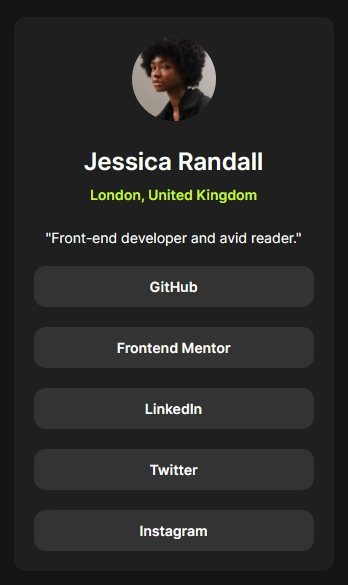

# Frontend Mentor - Social links profile solution

This is a solution to the [Social links profile challenge on Frontend Mentor](https://www.frontendmentor.io/challenges/social-links-profile-UG32l9m6dQ). Frontend Mentor challenges help you improve your coding skills by building realistic projects. 

## Table of contents

- [Overview](#overview)
  - [The challenge](#the-challenge)
  - [Screenshot](#screenshot)
  - [Links](#links)
- [My process](#my-process)
  - [Built with](#built-with)
  - [What I learned](#what-i-learned)
  - [Continued development](#continued-development)
  - [Useful resources](#useful-resources)
- [Author](#author)

## Overview

### The challenge

Users should be able to:

- See hover and focus states for all interactive elements on the page

### Screenshot

### Links

- [Solution URL](https://your-solution-url.com)
- [Live Site URL](https://yemima20.github.io/social-links-profile/)

## My process

### Built with

- Semantic HTML5 markup
- CSS 
  - Custom properties
  - Flexbox & grid
  - Pseudo-classes & function
  - Transition
- Mobile-first workflow

### What I learned

In this challenge, I learned more about using a bit of transition.

### Continued development

The areas I would like to focus on in future projects from this project are to be better and more creative of using transitions.

### Useful resources

- [Transition](https://web.dev/learn/css/transitions?hl=en) - This helped me to learn and use transition.

## Author

- Frontend Mentor - [@Yemima20](https://www.frontendmentor.io/profile/Yemima20)